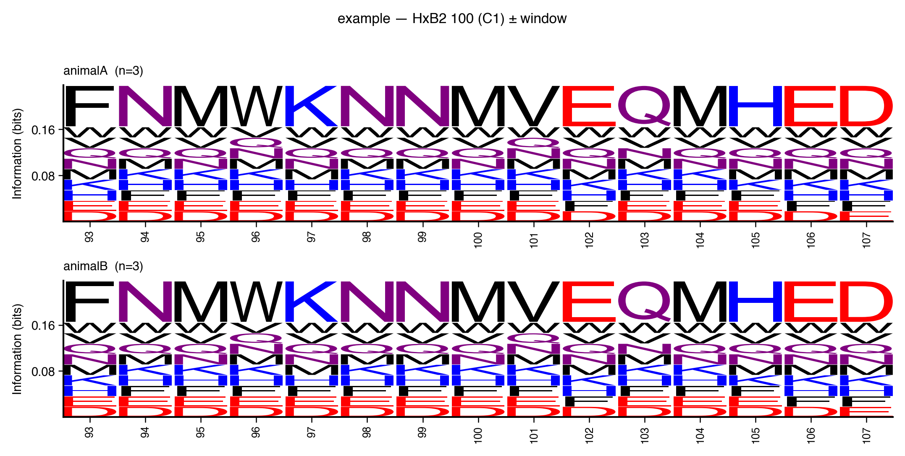

# tlogo

Sequence logo generator for aligned FASTA files with HxB2 coordinate mapping for HIV Env.



## Install

```bash
pip install tlogo
```

## Development

```bash
git clone https://github.com/tmsincomb/tlogo.git
cd tlogo
pip install -e ".[dev]"
```

## Usage

```bash
# Standard logo at specific HxB2 positions
tlogo logo alignment.fasta --positions 130,160,332

# Logo for an entire Env region
tlogo logo alignment.fasta --region V3

# Per-animal window logo around a single position
tlogo window alignment.fasta --position 100 --radius 7

# Auto-detect variant positions and generate window logos
tlogo auto alignment.fasta --variant-freq 0.5
```

## Testing

```bash
pytest -v
```

## Releasing

Version is managed automatically by [setuptools-scm](https://github.com/pypa/setuptools-scm) from git tags:

```bash
git tag v0.1.0
git push origin v0.1.0
```

PyPI publishing is handled by GitHub Actions via trusted publishing (OIDC). Configure your PyPI project to trust the `publish.yml` workflow.

## License

MIT
